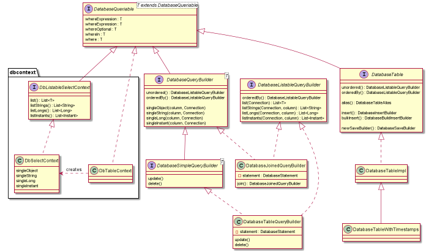

[](https://opensource.org/licenses/Apache-2.0)
[](https://maven-badges.herokuapp.com/maven-central/io.github.jhannes/fluent-jdbc)
[](https://github.com/jhannes/fluent-jdbc/actions/workflows/maven.yml)
[](https://jhannes.github.io/fluent-jdbc/apidocs/)
[](https://coveralls.io/github/jhannes/fluent-jdbc?branch=master)

# fluent-jdbc
Java database code without ORM in a pleasant and fluent style

Motivating code example, using [DbContext](http://jhannes.github.io/fluent-jdbc/apidocs/org/fluentjdbc/DbContext.html):

```jshelllanguage
DbContext context = new DbContext();

DbContextTable table = context.table("database_test_table");
DataSource dataSource = createDataSource();

try (DbContextConnection ignored = context.startConnection(dataSource)) {
    Object id = table.insert()
        .setPrimaryKey("id", null)
        .setField("code", 1002)
        .setField("name", "insertTest")
        .execute();

    assertThat(table.where("name", "insertTest").orderBy("code").listLongs("code"))
        .contains(1002L);
}

```

## Features

* [DbContextSaveBuilder](http://jhannes.github.io/fluent-jdbc/apidocs/org/fluentjdbc/DbContextSaveBuilder.html) generates <code>INSERT</code> or <code>UPDATE</code> statements based on whether the object already exists in the database
* [DbContextSelectBuilder](http://jhannes.github.io/fluent-jdbc/apidocs/org/fluentjdbc/DbContextSelectBuilder.html) lets you build queries where you can ensure that the `?`-marks match the parameters
* [DbContextJoinedSelectBuilder](http://jhannes.github.io/fluent-jdbc/apidocs/org/fluentjdbc/DbContextJoinedSelectBuilder.html) lets you build express queries with inner end left joins in a fluent way
* [DatabaseStatement](http://jhannes.github.io/fluent-jdbc/apidocs/org/fluentjdbc/http://jhannes.github.io/fluent-jdbc/apidocs/org/fluentjdbc/DbContextSaveBuilder.html) converts parameters of all statements created with Fluent JDBC. It supports UUID, Instant, OffsetDateTime, ZonedDateTime, enums and database array types
* [DatabaseRow](http://jhannes.github.io/fluent-jdbc/apidocs/org/fluentjdbc/DatabaseRow.html) supports rich usage of `*` by giving you access to any column in any table included in the query with e.g. `row.table("persons").getString("name")`. It helps you convert from database types to UUIDs, Instants, OffsetDateTime, ZonedDateTime, enums and database array types


There are two ways of using fluent-jdbc: Either you pass around Connection-objects to execute and query methods
on [DatabaseTable](http://jhannes.github.io/fluent-jdbc/apidocs/org/fluentjdbc/DatabaseTable.html),
or you use [DbContext](http://jhannes.github.io/fluent-jdbc/apidocs/org/fluentjdbc/DbContext.html) to bind a connection
to the thread. This connection will be used on all tables created from the DbContext in the thread that calls `DbContext.startConnection`.


## Central classes




## Full usage example

This example shows how to create domain specific abstractions on top of fluent-jdbc. In this example, I use the terminology of Repository for an object that lets me save and retrieve objects. You are free to call this e.g. DAO if you prefer.

[From UsageDemonstrationTest](https://github.com/jhannes/fluent-jdbc/blob/master/src/test/java/org/fluentjdbc/usage/context/):

```java
public class UsageDemonstrationTest {

    @Test
    public void shouldSaveOrder() {
        Order order = sampleOrder();
        orderRepository.save(order);
        assertThat(orderRepository.query().customerEmail(order.getCustomerEmail()).list())
                .extracting(Order::getOrderId)
                .contains(order.getOrderId());
    }

    @Test
    public void shouldUpdateOrder() {
        Order originalOrder = sampleOrder();
        orderRepository.save(originalOrder);
        Order updatedOrder = sampleOrder();
        updatedOrder.setOrderId(originalOrder.getOrderId());
        orderRepository.save(updatedOrder);
        assertThat(orderRepository.retrieve(originalOrder.getOrderId()))
                .hasNoNullFieldsOrProperties()
                .isEqualToComparingFieldByField(updatedOrder);
    }

}
```

```java
public class OrderRepository implements Repository<Order, UUID> {

    private final DbContextTable table;

    public OrderRepository(DbContext dbContext) {
        this.table = dbContext.tableWithTimestamps("orders");
    }

    @Override
    public DatabaseSaveResult.SaveStatus save(Order product) {
        DatabaseSaveResult<UUID> result = table.newSaveBuilderWithUUID("order_id", product.getOrderId())
                .setField("customer_name", product.getCustomerName())
                .setField("customer_email", product.getCustomerEmail())
                .execute();
        product.setOrderId(result.getId());
        return result.getSaveStatus();
    }

    @Override
    public Query query() {
        return new Query(table.query());
    }

    @Override
    public Optional<Order> retrieve(UUID uuid) {
        return table.where("order_id", uuid).singleObject(this::toOrder);
    }

    public class Query implements Repository.Query<Order> {

        private final DbContextSelectBuilder selectBuilder;

        public Query(DbContextSelectBuilder selectBuilder) {
            this.context = selectBuilder;
        }

        @Override
        public List<Order> list() {
            return context.list(row -> toOrder(row));
        }

        public Query customerEmail(String customerEmail) {
            return query(context.where("customer_email", customerEmail));
        }

        private Query query(DbContextSelectBuilder context) {
            return this;
        }
    }

    private Order toOrder(DatabaseRow row) {
        Order order = new Order();
        order.setOrderId(row.getUUID("order_id"));
        order.setCustomerName(row.getString("customer_name"));
        order.setCustomerEmail(row.getString("customer_email"));
        return order;
    }
}
```


# Developer notes

Running the dependent databases in docker:

```shell
docker compose up
```
