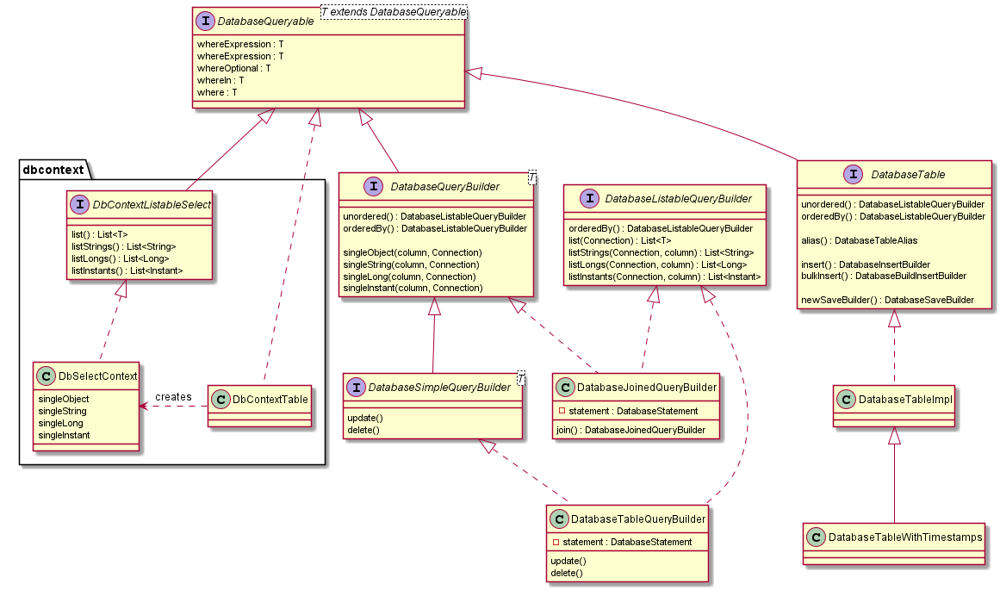

[](https://maven-badges.herokuapp.com/maven-central/io.github.jhannes/fluent-jdbc)
[](https://travis-ci.org/jhannes/fluent-jdbc)
[](https://coveralls.io/github/jhannes/fluent-jdbc?branch=master)

# fluent-jdbc
Java database code without ORM in a pleasant and fluent style

Motivating code example:

```java

DatabaseTable table = new DatabaseTableImpl("database_table_test_table");
Object id = table.insert()
    .setPrimaryKey("id", null)
    .setField("code", 1002)
    .setField("name", "insertTest")
    .execute(connection);

assertThat(table.where("name", "insertTest").orderBy("code").listLongs(connection, "code"))
    .contains(1002L);

```

## Central classes




## Full usage example

[From UsageDemonstrationTest](https://github.com/jhannes/fluent-jdbc/blob/master/src/test/java/org/fluentjdbc/usage/context/UsageDemonstrationTest.java):

```java
public class UsageDemonstrationTest {

    @Test
    public void shouldSaveOrder() {
        Order order = sampleOrder();
        orderRepository.save(order);
        assertThat(orderRepository.query().customerEmail(order.getCustomerEmail()).list())
                .extracting(Order::getOrderId)
                .contains(order.getOrderId());
    }

    @Test
    public void shouldUpdateOrder() {
        Order originalOrder = sampleOrder();
        orderRepository.save(originalOrder);
        Order updatedOrder = sampleOrder();
        updatedOrder.setOrderId(originalOrder.getOrderId());
        orderRepository.save(updatedOrder);
        assertThat(orderRepository.retrieve(originalOrder.getOrderId()))
                .hasNoNullFieldsOrProperties()
                .isEqualToComparingFieldByField(updatedOrder);
    }

}
```

```java
public class OrderRepository implements Repository<Order, UUID> {

    private final DbTableContext table;

    public OrderRepository(DbContext dbContext) {
        this.table = dbContext.tableWithTimestamps("orders");
    }

    @Override
    public DatabaseSaveResult.SaveStatus save(Order product) {
        DatabaseSaveResult<UUID> result = table.newSaveBuilderWithUUID("order_id", product.getOrderId())
                .setField("customer_name", product.getCustomerName())
                .setField("customer_email", product.getCustomerEmail())
                .execute();
        product.setOrderId(result.getId());
        return result.getSaveStatus();
    }

    @Override
    public Query query() {
        return new Query(table.query());
    }

    @Override
    public Optional<Order> retrieve(UUID uuid) {
        return table.where("order_id", uuid).singleObject(this::toOrder);
    }

    public class Query implements Repository.Query<Order> {

        private DbSelectContext context;

        public Query(DbSelectContext context) {
            this.context = context;
        }

        @Override
        public List<Order> list() {
            return context.list(row -> toOrder(row));
        }

        public Query customerEmail(String customerEmail) {
            return query(context.where("customer_email", customerEmail));
        }

        private Query query(DbSelectContext contex) {
            return this;
        }
    }

    private Order toOrder(DatabaseRow row) throws SQLException {
        Order order = new Order();
        order.setOrderId(row.getUUID("order_id"));
        order.setCustomerName(row.getString("customer_name"));
        order.setCustomerEmail(row.getString("customer_email"));
        return order;
    }
}
```


# Notes on running databases with docker

### MSSQL

* `docker run --name sqlserver -e ACCEPT_EULA=Y -e SA_PASSWORD=28sdnnasaAs -p 1433:1433 -d mcr.microsoft.com/mssql/server:2017-latest`
* `docker exec -it sqlserver /opt/mssql-tools/bin/sqlcmd -S localhost -U sa -P 28sdnnasaAs`
* `create login fluentjdbc_test with password = '28sdnnasaAs'; go`
* `create database fluentjdbc_test; go`
* `create user fluentjdbc_test for login fluentjdbc_test; go`
* `use fluentjdbc_test; go`
* `EXEC sp_changedbowner 'fluentjdbc_test'; go`
* Set `-Dtest.db.sqlserver.password=...` when running the test
